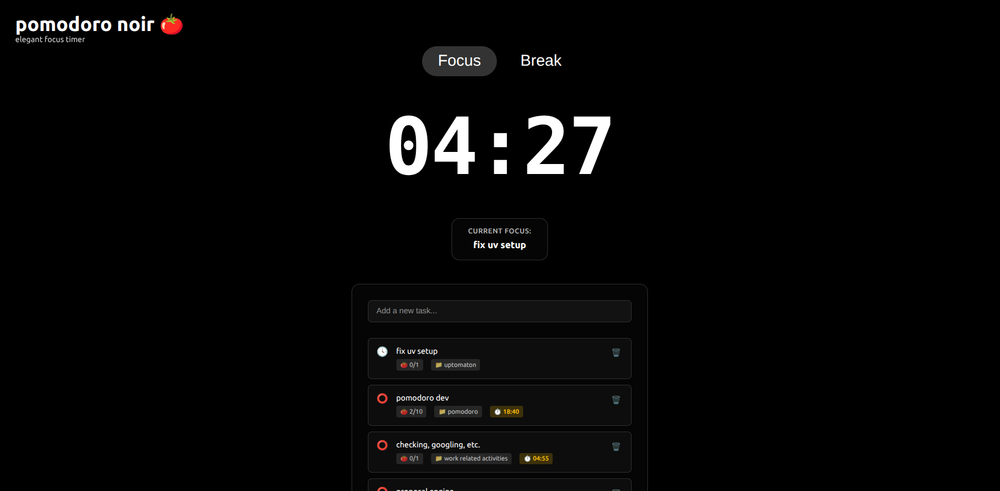

# Pomodoro Noir Timer 🍅

A minimalist, dark-themed Pomodoro timer web application built with React and TypeScript, designed for deep work sessions.

Deployed to Github: https://adellantado.github.io/pomodoro-noir-timer/

## Features

### 🕒 Pomodoro Timer
- **Simple Pomodoro Workflow:** Start focused work sessions (default 25 minutes), followed by short breaks (default 5 minutes) to maximize productivity.
- **Session Progression:** Automatically cycles through work and break intervals according to the Pomodoro Technique.
- **Session Counter:** Tracks the number of completed Pomodoros in your current cycle.

### 🌑 Minimalist Dark Theme
- **Distraction-Free UI:** Clean, uncluttered interface with a dark color palette for comfortable use during day or night.
- **Responsive Design:** Looks great on desktops, laptops, and mobile devices.

### ⏸️ Timer Controls
- **Start, Pause, and Reset:** Easily control your timer with intuitive buttons.
- **Automatic Transitions:** Timer automatically switches between work and break sessions, but you can manually skip or reset at any time.

### 📝 Task Management
- **Task List:** Add, edit, and delete tasks to organize your work sessions.
- **Focus Mode:** Select a task to focus on during your Pomodoro session.

### 🔔 Notifications & Alerts
- **Audio Alerts:** Get notified with a sound when a session ends (browser must be unmuted).
- **Visual Cues:** The timer and interface clearly indicate whether you are in a work or break session.

### 💾 Persistence
- **Session & Task Saving:** Your timer state and tasks are saved locally, so you can close and reopen the app without losing progress.

---

Whether you're a student, developer, or anyone looking to manage time more effectively, **Pomodoro Noir Timer** helps you stay focused and productive with a beautiful, no-nonsense interface.
